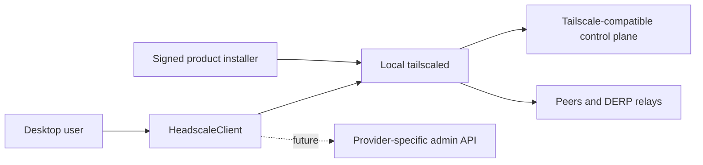
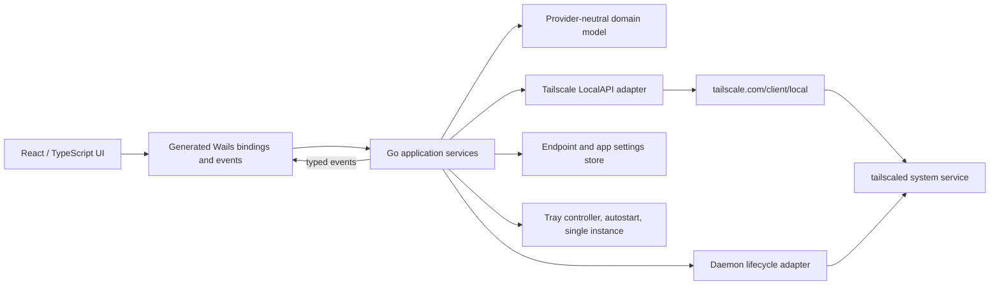

# Architecture

## Context



The control-server URL selects the coordination server. DERP endpoints are
normally supplied by that control plane and are not modeled as login servers.

## Container view



## Ownership boundaries

### React frontend

- Renders domain DTOs and issues explicit commands.
- Owns navigation, transient form state, and presentation state.
- Never talks to LocalAPI, the filesystem, or a control server directly.
- Never receives raw `ipn`, `tailcfg`, or `ipnstate` values.

### Application services

- Coordinate snapshots, login, preference mutations, profiles, and watcher lifetime.
- Apply timeouts, cancellation, serialization, and error classification.
- Convert adapter values into stable product DTOs.
- Publish coarse domain events rather than raw daemon notifications.

### LocalAPI adapter

- Is the only package importing unstable Tailscale LocalAPI surface area.
- Owns one zero-value `local.Client`; its fields are not changed after first use.
- Handles watch masks, fallback polling, stream restart, and version compatibility.
- Creates `ipn.MaskedPrefs` and always sets the matching `FooSet` bit.

### Configuration store

- Persists schema-versioned, provider-neutral endpoint metadata.
- Persists the selected `zh-CN` or `en-US` presentation language; `zh-CN` is
  applied when an older configuration has no language field.
- Uses the operating-system user config directory and atomic replacement.
- Does not persist auth keys, browser tokens, private node keys, or daemon state.

### Platform integration

- Wails owns window, tray, single instance, autostart, and packaging behavior.
- The native tray controller renders product DTOs from the latest application
  snapshot and calls application services for mutations. It does not call
  LocalAPI or read configuration files directly.
- Snapshot delivery updates both Wails frontend events and native tray state;
  neither presentation surface is authoritative over the other.
- The WebView and tray read language from the same application snapshot. The
  tray does not maintain a second locale preference.
- The GUI runs as the current user and is not globally elevated.
- Privileged networking remains in the separately running daemon service.
- The lifecycle adapter exposes inspection and one fixed ensure operation; it
  does not expose generic command execution.
- Platform installers own daemon payload placement, service registration,
  upgrade, and ownership-safe uninstall behavior.

### Daemon distribution

- A compatible existing daemon is classified as external and reused.
- A service whose executable is inside the product installation is managed.
- A verified payload with no service is prepared and can be installed.
- Local executable paths never cross the frontend contract.
- Windows payload generation verifies source hash, file hashes, and signers.
- Linux payload generation verifies official archive and file hashes plus Go
  build metadata for the pinned Tailscale module and command paths.
- Native Linux packages install a dedicated systemd unit and state directory,
  but reuse a loaded external `tailscaled.service` instead of enabling it.

## Dependency rule

Dependencies point inward:

```text
frontend -> Wails contract -> application -> domain
                                  |
                                  +-> adapters -> external libraries / OS
```

The domain and application layers do not depend on Wails UI types. This makes
backend state-machine tests possible without starting a WebView.

## Failure strategy

- Connection refused: daemon missing or stopped.
- Access denied/403: current user cannot access LocalAPI.
- Precondition failed/412: daemon policy or state prevents the action.
- Unsupported JSON/endpoint: possible daemon incompatibility.
- Watch EOF: mark events stale, fetch a full snapshot, and reconnect with backoff.
- New watch mask rejected: retry with mask zero and use snapshot polling.

Errors cross the frontend boundary as stable codes plus a safe message and
optional diagnostic detail. UI logic never matches platform error strings.
